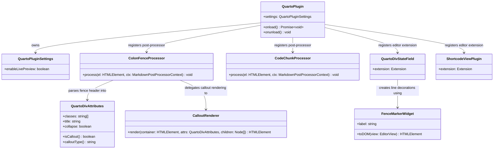

# Quarto Markdown Support — Obsidian Plugin (V1)

## Requirements

Implement an Obsidian plugin that provides visual rendering support for Quarto markdown extensions, enabling authors to write Quarto-flavored `.md`/`.qmd` documents inside Obsidian without losing readability. The plugin must:

- Render Quarto colon-fence divs (`:::`) as styled blocks in Reading View (preview mode) by reconstructing fence structure from raw DOM output
- Render Quarto callout blocks (`.callout-note`, `.callout-warning`, `.callout-important`, `.callout-tip`, `.callout-caution`) with distinct visual styling and titles in Reading View
- Provide live-editor (CodeMirror 6) visual cuing for colon-fence block boundaries and inline shortcode syntax while the author is editing
- Visually distinguish executable code chunks (`` ```{python} ``, `` ```{r} ``, etc.) from ordinary code blocks in Reading View
- Operate non-destructively — never alter source file content; all rendering is decorative overlay only
- Degrade gracefully: constructs that cannot be fully rendered must at minimum be visually flagged rather than left as raw `:::` text

**Out of scope (V1)**: Quarto code execution, cross-reference resolution, bibliography rendering, tabset interactivity, callout collapse toggle behavior.

---

## Entities



---

## Approach

1. **Prerequisite: Plugin cleanup and stabilisation**
   - Remove all Obsidian sample-plugin boilerplate from main.ts (ribbon icon, SampleModal, sample commands, global click listener, setInterval demo) — these are unrelated to Quarto and add noise
   - Rename `MyPlugin` → `QuartoPlugin`, `MyPluginSettings` → `QuartoPluginSettings`
   - Fix the syntax error in statefield.ts (dangling `}` after `iterChanges` block) so the plugin compiles
   - Fix the null-dereference in colonfence.ts (`elem.find("p")` is not null-guarded)
   - Retain the settings infrastructure and lifecycle methods

2. **Preview/Reading mode — `registerMarkdownPostProcessor`**
   - Quarto's `:::` fences are rendered by Obsidian as plain `<p>` elements containing `:::` text — the post-processor must reconstruct block structure by walking sibling DOM nodes
   - Strategy: iterate child nodes of the post-processor element; when a `<p>` node whose trimmed text starts with `:::` is found, parse its attributes, collect subsequent siblings until a matching closing `<p>:::` is found, then replace the collected range with a styled `<div>`
   - Nesting handled via a depth counter: an opening `:::` increments depth, a closing `:::` decrements; reconstruction only triggers at depth 0
   - Chunking risk: if the opening and closing `:::` land in different post-processor invocations, reconstruction is not possible — document this limitation; do not crash
   - Callout blocks are a specialisation of colon-fence rendering: if `attrs.isCallout()` is true, render a structured callout box (icon + title + body) using CSS classes; otherwise render a generic styled fence div
   - Executable code chunk post-processor: scan `<pre><code>` blocks for a language identifier matching `/^\{[a-z]+\}/`; add a `<span class="qmd-code-lang">` badge above the block

3. **Live-editor mode — CodeMirror 6 `registerEditorExtension`**
   - Use a `StateField<DecorationSet>` for block-level constructs (colon fences): iterate all document lines on each transaction that changes the document; lines matching `/^:::\s*(\{[^}]*)?\s*$/` receive a line decoration with class `cm-qmd-fence-marker`; opening fences with attributes receive an additional data attribute for the fence type
   - Use a `ViewPlugin` with `MatchDecorator` for inline shortcode syntax (``): regexp `/\{\{<\s*\w+[^>]*>\}\}/g`; matched ranges receive a `Decoration.mark` with class `cm-qmd-shortcode`
   - Both extensions must be registered as an array via `this.registerEditorExtension([quartoDivStateField, shortcodePlugin])`

4. **CSS styling**
   - All visual styling lives in `styles.css` — no inline styles injected by JavaScript
   - Callout variants (note, warning, important, tip, caution) each have a left-border color and icon via CSS `::before` pseudo-element
   - Live-editor fence markers use subtle background tinting so the author can see block boundaries without obstructing text editing

---

## Structure

### Inheritance / Interface Relationships
1. `QuartoPlugin` extends `Plugin` (Obsidian API)
2. `FenceMarkerWidget` extends `WidgetType` (CodeMirror 6 `@codemirror/view`)
3. `ColonFenceProcessor` is a plain class whose `process` method matches the `MarkdownPostProcessorContext` callback signature
4. `CodeChunkProcessor` is a plain class whose `process` method matches the `MarkdownPostProcessorContext` callback signature
5. `QuartoDivStateField` is a module-level `const` constructed via `StateField.define<DecorationSet>()` — no class wrapper needed
6. `ShortcodeViewPlugin` is a module-level `const` constructed via `ViewPlugin.fromClass()` with an internal `MatchDecorator` — no standalone class needed

### Dependencies
1. `QuartoPlugin.onload()` creates and registers `ColonFenceProcessor`, `CodeChunkProcessor`, `QuartoDivStateField`, `ShortcodeViewPlugin`
2. `ColonFenceProcessor.process()` calls `parseQuartoDivAttributes()` (shared utility) and `CalloutRenderer.render()`
3. `QuartoDivStateField.update()` calls `parseQuartoDivAttributes()` (same shared utility) for opening fence lines
4. `FenceMarkerWidget` is instantiated by `QuartoDivStateField` when building decorations
5. `ShortcodeViewPlugin` owns its internal `MatchDecorator` — no cross-module dependency

### File / Module Layout
```
main.ts          — QuartoPlugin entry point; registers all extensions
colonfence.ts    — ColonFenceProcessor + CalloutRenderer
codechunk.ts     — CodeChunkProcessor (new file)
quartoattrs.ts   — parseQuartoDivAttributes() shared utility + QuartoDivAttributes type (new file)
statefield.ts    — QuartoDivStateField (rewrite) + FenceMarkerWidget
matchdecorator.ts — ShortcodeViewPlugin (repurpose existing file; remove placeholder widget)
emoji.ts         — retain as-is or remove (not used by Quarto support)
styles.css       — all visual styling for callouts, fence markers, code chunk badges
```

---

## Operations

### Task 1: Clean up main.ts and fix plugin skeleton

1. Responsibility: Remove boilerplate, rename classes, retain plugin lifecycle and settings infrastructure
2. Changes:
   - Delete: `SampleModal` class, `ribbonIconEl` block, `statusBarItemEl` block, all three `addCommand` calls, `registerDomEvent` click handler, `registerInterval` call
   - Delete: inline emoji post-processor (the one scanning for `:emoji:` code elements) — not needed for Quarto
   - Delete: `emojiListField` import and `this.registerEditorExtension(emojiListField)` call
   - Rename: `MyPlugin` → `QuartoPlugin`, `MyPluginSettings` → `QuartoPluginSettings`
   - Replace setting `mySetting: string` with `enableLivePreview: boolean` (default `true`)
   - Update `DEFAULT_SETTINGS` accordingly
   - Update `SampleSettingTab` → `QuartoSettingTab` with a toggle for `enableLivePreview`
3. After cleanup, `onload()` body should only contain: `loadSettings()`, `registerMarkdownPostProcessor(colonfenceProcessor.process.bind(colonfenceProcessor))`, `registerMarkdownPostProcessor(codeChunkProcessor.process.bind(codeChunkProcessor))`, conditional `registerEditorExtension(...)`, `addSettingTab(...)`

### Task 2: Create `quartoattrs.ts` — shared attribute parser

1. Responsibility: Parse a raw `:::` fence header line into a typed attributes object; used by both preview-mode processor and live-editor StateField
2. Type definition:
   ```
   interface QuartoDivAttributes {
     classes: string[];      // e.g. ["callout-note", "my-class"]
     title: string;          // "" if not present
     collapse: boolean;      // false if not present
   }
   ```
3. Method: `parseQuartoDivAttributes(line: string): QuartoDivAttributes`
   - Input: full fence opening line, e.g. `::: {.callout-note title="My Note" collapse="true"}`
   - Extract classes: match all `/\.\w[-\w]*/g`, strip leading dot
   - Extract title: match `/title="([^"]*)"/`, group 1; default `""`
   - Extract collapse: match `/collapse="(true|false)"/`, group 1 === `"true"`; default `false`
   - Return constructed `QuartoDivAttributes`
4. Method: `QuartoDivAttributes.isCallout(): boolean`
   - Return `this.classes.some(c => c.startsWith("callout-"))`
5. Method: `QuartoDivAttributes.calloutType(): string`
   - Return first class starting with `"callout-"`, stripped of prefix; e.g. `"note"`, `"warning"`. Returns `""` if not a callout.

### Task 3: Rewrite `colonfence.ts` — `ColonFenceProcessor` + `CalloutRenderer`

1. Responsibility: Post-processor that reconstructs colon-fence block structure in Reading View and renders callout blocks with appropriate styling

2. `ColonFenceProcessor.process(el: HTMLElement, ctx: MarkdownPostProcessorContext): void`
   - Get all child nodes of `el` as an array: `Array.from(el.childNodes)`
   - Iterate with an index `i`; when a child is an `HTMLElement` with tag `P` and `child.innerText.trim()` matches `/^:::/`:
     - Record this as `fenceStart` at index `i`; parse `attrs = parseQuartoDivAttributes(child.innerText.trim())`
     - Initialize `depth = 1`, `contentNodes: Node[] = []`, advance `j = i + 1`
     - While `j < nodes.length` and `depth > 0`:
       - If `nodes[j]` is a `<p>` starting with `:::`: if line is a pure closing `:::` (no attributes after trimming), decrement depth; else increment depth
       - If `depth > 0`: push `nodes[j]` to `contentNodes`
       - Advance `j`
     - If `depth !== 0` after the loop: no matching closing fence found in this chunk — skip (do not crash; leave raw nodes)
     - Otherwise: call `CalloutRenderer.render(el, attrs, contentNodes)` to get a replacement `div`; replace nodes from `i` to `j-1` by calling `el.replaceChildren(...)` or by inserting the new div before `nodes[i]` and removing `nodes[i]` through `nodes[j-1]`
     - Set `i = i + 1` (skip to after the reconstructed block)
   - Guard all `<p>` text access with null checks: `if (node instanceof HTMLElement && node.tagName === 'P' && node.innerText)`

3. `CalloutRenderer.render(container: HTMLElement, attrs: QuartoDivAttributes, children: Node[]): HTMLElement`
   - Create outer `div.qmd-colon-fence`
   - If `attrs.isCallout()`:
     - Add class `qmd-callout qmd-callout-${attrs.calloutType()}`
     - Create `div.qmd-callout-title` with text `attrs.title || capitalise(attrs.calloutType())`
     - Create `div.qmd-callout-body` and append cloned `children` into it
     - Append title div then body div to outer div
   - Else:
     - Add class `qmd-generic-fence`
     - If `attrs.classes.length > 0`: add `data-qmd-classes="${attrs.classes.join(' ')}"` attribute
     - Append cloned `children` directly to outer div
   - Return outer div

### Task 4: Create `codechunk.ts` — `CodeChunkProcessor`

1. Responsibility: Identify Quarto executable code chunk blocks in Reading View and add a visual language badge

2. `CodeChunkProcessor.process(el: HTMLElement, ctx: MarkdownPostProcessorContext): void`
   - Find all `<code>` elements inside `el`: `el.findAll("code")`
   - For each code element:
     - Check if its parent `<pre>` element has a class matching `/language-\{(\w+)\}/` or if the code element itself has such a class
     - Alternatively: check if the first line of `code.innerText` matches `/^\{[a-z]+\}/` (for cases where Obsidian passes the language spec as text)
     - If matched: extract language name (e.g. `python`, `r`, `julia`)
     - Create `span.qmd-code-lang` with text content equal to the language name
     - Insert the badge as the first child of `pre.parentElement` or directly before the `<pre>` element
     - Add class `qmd-code-chunk` to the `<pre>` element

### Task 5: Rewrite `statefield.ts` — `QuartoDivStateField`

1. Responsibility: Live-editor CodeMirror 6 StateField that adds line decorations to `:::` fence boundaries, giving the author visual feedback about block structure while editing

2. `QuartoDivStateField` — `StateField.define<DecorationSet>()`:
   - `create(state: EditorState): DecorationSet` — call `buildDecorations(state.doc)` and return result
   - `update(decorations: DecorationSet, tr: Transaction): DecorationSet`
     - If `!tr.docChanged`: return `decorations`
     - Return `buildDecorations(tr.newDoc)`
   - `provide(field): Extension` — return `EditorView.decorations.from(field)`

3. `buildDecorations(doc: Text): DecorationSet`
   - Create `RangeSetBuilder<Decoration>`
   - Iterate lines: `for (let i = 1; i <= doc.lines; i++) { const line = doc.line(i); ... }`
   - If `line.text.trim().match(/^:::/)`:
     - Determine if opening (has content after `:::` or `{`) or closing (bare `:::`)
     - Opening: add `Decoration.line({ class: "cm-qmd-fence-open" })` at `line.from`
     - Closing: add `Decoration.line({ class: "cm-qmd-fence-close" })` at `line.from`
   - Call `builder.finish()` and return

4. Remove the broken `iterChanges` block, unused `EmojiWidget` import, and `MarkdownView` import entirely

### Task 6: Rewrite `matchdecorator.ts` — `ShortcodeViewPlugin`

1. Responsibility: Live-editor ViewPlugin that marks Quarto shortcode syntax (``) with a visual CSS class so authors can recognise shortcodes while editing

2. Replace the existing `placeholderMatcher` (which matched `[[word]]`) with:
   ```
   const shortcodeMatcher = new MatchDecorator({
     regexp: /\{\{<\s*\w+[^>]*>\}\}/g,
     decoration: () => Decoration.mark({ class: "cm-qmd-shortcode" }),
   });
   ```

3. `ShortcodeViewPlugin` — `ViewPlugin.fromClass(class { ... }, { decorations: ... })`:
   - Internal field `decorations: DecorationSet`
   - `constructor(view: EditorView)`: `this.decorations = shortcodeMatcher.createDeco(view)`
   - `update(update: ViewUpdate)`: `this.decorations = shortcodeMatcher.updateDeco(update, this.decorations)`
   - Plugin options: `{ decorations: v => v.decorations }` (no `atomicRanges` needed — shortcodes are marked, not replaced)

4. Remove `PlaceholderWidget` class (no longer needed)

### Task 7: Update `main.ts` — wire all Quarto processors

1. Responsibility: Register all Quarto extension points in `QuartoPlugin.onload()` in the correct order

2. Imports to add:
   - `import { ColonFenceProcessor, CalloutRenderer } from "./colonfence"`
   - `import { CodeChunkProcessor } from "./codechunk"`
   - `import { quartoDivStateField } from "./statefield"`
   - `import { shortcodeViewPlugin } from "./matchdecorator"`

3. `onload()` registration sequence:
   ```
   const colonfenceProcessor = new ColonFenceProcessor();
   const codeChunkProcessor = new CodeChunkProcessor();
   this.registerMarkdownPostProcessor(colonfenceProcessor.process.bind(colonfenceProcessor));
   this.registerMarkdownPostProcessor(codeChunkProcessor.process.bind(codeChunkProcessor));
   if (this.settings.enableLivePreview) {
     this.registerEditorExtension([quartoDivStateField, shortcodeViewPlugin]);
   }
   this.addSettingTab(new QuartoSettingTab(this.app, this));
   ```

### Task 8: Update `styles.css` — callout and fence visual styling

1. Generic fence container:
   ```css
   .qmd-colon-fence { border-left: 3px solid var(--color-base-50); padding: 0.5em 1em; margin: 0.5em 0; }
   ```

2. Callout base:
   ```css
   .qmd-callout { border-radius: 4px; padding: 0.75em 1em; margin: 0.75em 0; }
   .qmd-callout-title { font-weight: 600; margin-bottom: 0.4em; }
   .qmd-callout-title::before { margin-right: 0.4em; }
   .qmd-callout-body { }
   ```

3. Callout variants (left border + title color + icon):
   ```css
   .qmd-callout-note    { border-left: 4px solid #4a90d9; background: rgba(74,144,217,0.08); }
   .qmd-callout-note    .qmd-callout-title::before { content: "ℹ"; color: #4a90d9; }
   .qmd-callout-warning { border-left: 4px solid #e6a817; background: rgba(230,168,23,0.08); }
   .qmd-callout-warning .qmd-callout-title::before { content: "⚠"; color: #e6a817; }
   .qmd-callout-important { border-left: 4px solid #d94a4a; background: rgba(217,74,74,0.08); }
   .qmd-callout-important .qmd-callout-title::before { content: "✖"; color: #d94a4a; }
   .qmd-callout-tip     { border-left: 4px solid #2ecc71; background: rgba(46,204,113,0.08); }
   .qmd-callout-tip     .qmd-callout-title::before { content: "✔"; color: #2ecc71; }
   .qmd-callout-caution { border-left: 4px solid #e67e22; background: rgba(230,126,34,0.08); }
   .qmd-callout-caution .qmd-callout-title::before { content: "🔥"; color: #e67e22; }
   ```

4. Live-editor fence markers (CodeMirror):
   ```css
   .cm-qmd-fence-open  { background: rgba(74,144,217,0.06); border-left: 2px solid #4a90d9; }
   .cm-qmd-fence-close { background: rgba(74,144,217,0.06); border-left: 2px solid #4a90d9; }
   .cm-qmd-shortcode   { color: var(--color-purple); font-style: italic; }
   ```

5. Executable code chunk badge:
   ```css
   .qmd-code-lang { display: inline-block; font-size: 0.7em; font-family: var(--font-monospace); background: var(--color-base-30); color: var(--color-base-70); border-radius: 3px; padding: 1px 6px; margin-bottom: 2px; }
   .qmd-code-chunk { border-top: 2px solid var(--color-base-30); }
   ```

---

## Norms

1. **TypeScript**: All new files use TypeScript; no `any` types except where Obsidian's own API forces it (e.g., `context` parameter of post-processor callbacks where the type is not imported). Use `import type` for type-only imports.

2. **Null safety in DOM queries**: Every call to `.find()`, `.querySelector()`, or sibling traversal must be null-guarded before accessing properties. Pattern: `const p = el.find("p"); if (!p) return;`

3. **No source mutation**: Post-processors and editor extensions must never call APIs that modify the underlying document (no `editor.replaceRange`, no `file.modify`, no input event dispatch). All changes are to the rendered HTML DOM or CodeMirror decoration layer only.

4. **CodeMirror extension exports**: Each CM6 extension module exports a single `const` (e.g., `export const quartoDivStateField`, `export const shortcodeViewPlugin`) — not a class. The extension is constructed at module load time using `StateField.define()` or `ViewPlugin.fromClass()`.

5. **CSS class naming**: All preview-mode classes use the prefix `qmd-`; all live-editor CodeMirror classes use the prefix `cm-qmd-`. This avoids collisions with Obsidian built-in classes.

6. **No inline styles**: Visual styling is expressed exclusively through CSS classes in `styles.css`. JavaScript/TypeScript code only adds/removes class names and data attributes.

7. **Graceful degradation pattern**: Any block-level reconstruction that fails (e.g., no matching closing fence in current chunk) must leave the original DOM nodes untouched and return without throwing. Log a `console.debug` at most — no `console.error` or uncaught exceptions.

8. **Module structure**: One concern per file. Do not add multiple unrelated processors to the same file. New feature files go alongside existing ones at the project root (no `src/` directory — project uses flat layout per esbuild config).

9. **Settings**: Boolean settings default to `true` (opt-in features enabled by default). Settings keys use camelCase. Settings tab uses Obsidian's `Setting` API with `.setName()`, `.setDesc()`, and `.addToggle()`.

---

## Safeguards

1. **Functional constraints**:
   - The plugin MUST NOT alter `.md` or `.qmd` file content — no write operations to vault files
   - The plugin MUST NOT interfere with Obsidian's built-in Markdown rendering — post-processors only mutate the rendered HTML output, not the source
   - The plugin MUST compile cleanly with `tsc -noEmit -skipLibCheck` before any feature is considered complete
   - Live-editor extensions MUST be registered only when `settings.enableLivePreview === true`

2. **Performance constraints**:
   - `QuartoDivStateField.update()` MUST return immediately (without rebuilding decorations) when `!tr.docChanged`
   - Post-processor DOM walks MUST exit early if no `:::` text is found anywhere in the element (`!el.innerText.includes(":::")`)
   - `buildDecorations()` iterates lines once — no nested loops or repeated document scans

3. **Safety constraints on DOM reconstruction**:
   - Fence reconstruction MUST use a depth counter to correctly handle nested `:::` divs — a flat search for the next closing `:::` is prohibited
   - If a closing fence is not found within the current post-processor chunk, the reconstruction MUST be skipped entirely — partial reconstruction (wrapping only the opening) is prohibited
   - All node cloning before DOM mutation MUST use `node.cloneNode(true)` to avoid detached-node errors

4. **CodeMirror 6 decoration constraints**:
   - Line decorations from `QuartoDivStateField` MUST be built using `Decoration.line()` (not `Decoration.replace()`) — replace decorations on multiline ranges require complex range management and will cause cursor artifacts
   - The `RangeSetBuilder` MUST receive ranges in ascending order — ranges must be added in document order during the line iteration loop
   - `ShortcodeViewPlugin` MUST NOT use `atomicRanges` — shortcode marks are visual only and must remain editable in place

5. **Obsidian API constraints**:
   - All post-processors registered via `registerMarkdownPostProcessor` are automatically deregistered on plugin unload — no manual cleanup needed
   - All editor extensions registered via `registerEditorExtension` are automatically deregistered on plugin unload — no manual cleanup needed
   - The plugin MUST NOT use deprecated Obsidian API methods (check `obsidian.d.ts` for `@deprecated` annotations)

6. **Attribute parsing constraints**:
   - `parseQuartoDivAttributes` MUST handle both `:::{.class}` (no space) and `::: {.class}` (with space) as valid opening fence syntax
   - `parseQuartoDivAttributes` MUST return a valid `QuartoDivAttributes` object (with empty defaults) even when the input line has no attribute block — never throw or return null
   - Attribute parsing is regex-based and intentionally limited — it does not need to handle arbitrary Pandoc attribute syntax; only CSS classes, `title=`, and `collapse=` are extracted

7. **V1 scope constraints**:
   - Do NOT implement tabset interactivity (tab switching via JS click handlers)
   - Do NOT implement callout collapse/expand toggle behavior
   - Do NOT attempt cross-reference resolution (`@fig-`, `@tbl-`) in V1 — visual flagging only if time permits
   - Do NOT add any runtime dependencies beyond those already in `package.json` (`@codemirror/language`, `obsidian`) — no new npm packages

8. **Build constraints**:
   - `esbuild.config.mjs` must not be modified — all new files are imported from `main.ts` and resolved by the existing bundler configuration
   - All new `.ts` files must be listed in `tsconfig.json`'s `include` array if they are not already captured by a glob pattern
